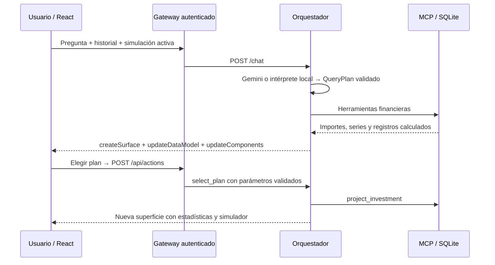

# Interfaces financieras generadas con A2UI

Cada consulta de la web produce una nueva superficie a partir de resultados de herramientas MCP. Gemini interpreta intención y parámetros; el orquestador decide qué herramientas invocar y compone los mensajes de interfaz. Los importes y las series siempre se calculan desde el dataset o mediante fórmulas de simulación. El modelo no escribe HTML, JavaScript, SQL ni importes para mostrar.

Se implementa un subconjunto de los [mensajes A2UI v0.9](https://a2ui.org/specification/v0_9/server_to_client.json), con catálogo propio `lazy-bank:finance-v1`. El esquema de componentes está en [`catalog.json`](../packages/visual-engine/catalog.json). No es el catálogo estándar ni una implementación completa de A2UI/A2A.

## Flujo

Las respuestas HTTP agrupan tres mensajes en `a2ui`. Se crea una superficie con ID nuevo, se carga su modelo de datos y se declara un árbol plano con raíz `root`. Los componentes referencian datos mediante rutas JSON Pointer. React mantiene una superficie visible y reemplaza la anterior en cada respuesta. No hay streaming incremental, `deleteSurface`, sincronización A2A ni ejecución de funciones remotas en el navegador.

## Catálogo y acciones

| Componentes | Uso |
| --- | --- |
| Column, Row, Text, Notice | Distribución, texto y contexto |
| Metric, FinancialChart, DataTable | Indicadores, gráficas con tabla accesible y movimientos |
| BudgetList, GoalList | Presupuestos y metas con progreso |
| PlanCard, DebtCard, Button | Acciones pertinentes a la consulta |
| Simulator | Capital, aportación mensual y plazo editables |

Los eventos permitidos son `select_plan`, `simulate_investment`, `compare_plans`, `simulate_debt` y `show_transactions`. El cliente envía un sobre `version: v0.9` con `action: {name, surfaceId, sourceComponentId, timestamp, context}`. El backend valida nombres, identificadores y rangos; no confía en el saldo ni en la tasa enviados por el cliente. La API vuelve a calcular los resultados mediante MCP.

La simulación activa viaja en el siguiente mensaje del chat, de modo que “¿y si aporto $2,000 al mes?” conserva el plan, capital y plazo. El historial es acotado y vive en la sesión del navegador; no se persiste entre recargas.

El renderer valida mensajes con Zod, limita componentes, comprueba referencias y ciclos, rechaza componentes desconocidos y muestra recuperación ante errores de renderizado. Las claves de Gemini, Auth0 y ElevenLabs permanecen en el servidor.

Web y Android renderizan el catálogo financiero completo. El validador de protocolo se comparte; React Native usa vistas nativas y SVG, mientras la web usa React y Chart.js. Los dos clientes envían las mismas acciones al gateway, conservan el contexto de la simulación y cambian la paleta según el dominio. Ver [ejecución en Android](mobile.md).

Las preguntas ilegibles, fuera de alcance, sin datos o con problemas del proveedor invocan `report_query_issue` en MCP. Su resultado genera una vista de aclaración. `AI_MODE=gemini` exige interpretación real del modelo; el error de cuota se comunica explícitamente. Las modificaciones de presentación también pasan por Gemini en ese modo.
