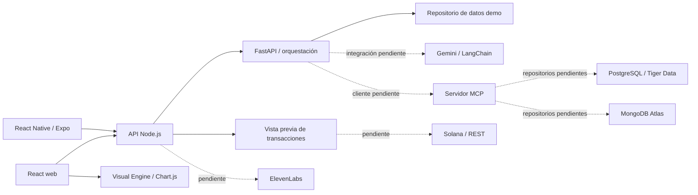

# Arquitectura de la base

La especificación original se conserva en [Arquitectura.md](Arquitectura.md). Se eligieron LangChain, Chart.js y Expo entre las alternativas del documento.

| Capa | Ruta | Estado |
| --- | --- | --- |
| Web | `apps/web` | Saldo ficticio, chat conectado, gráfica/tabla y acciones de vista previa |
| Móvil | `apps/mobile` | Saldo ficticio, chat, tabla textual y acciones de vista previa |
| Gateway | `services/api` | HTTP, validación, proxy a IA y vistas previas sin movimientos |
| IA | `services/ai/app` | Clasificador por reglas para deudas, ingresos e inversiones |
| Gemini | `services/ai/app/providers` | Factory LangChain opcional; no conectada al chat |
| MCP | `services/ai/app/mcp` | Servidor stdio con herramienta de consulta de datos ficticios; cliente pendiente |
| Datos | `infra/database`, `services/ai/app/data` | Esquema inicial y factories de conexión; persistencia pendiente |
| Visual | `packages/visual-engine` | Renderizador Chart.js; contrato interno, no protocolo A2UI completo |
| Transacciones | `services/api/src/transactions` | Vista previa validada; ejecución real pendiente |
| Voz / seguridad | `services/api/src/integrations` | Puntos de integración documentados |
| Infraestructura | `infra/docker`, `infra/vultr` | Compose local y guía para futuro despliegue |

## Decisiones y siguientes pasos

- El flujo ejecutable usa datos ficticios y no requiere cuentas externas. Agregar una clave Gemini por sí solo no cambia el modo de operación.
- La demo grafica series predefinidas. Faltan proyecciones dinámicas, entradas multimodales y el cliente MCP en el orquestador.
- Para A2UI se debe incorporar un renderer compatible y validar mensajes contra una versión del protocolo y un catálogo de componentes. El contrato actual de gráficas es específico del proyecto.
- El documento menciona una referencia Figma, pero no contiene enlace ni archivo de diseño. La interfaz incluida es una base propia.
- PostgreSQL almacena importes con `NUMERIC`, con extensión TimescaleDB para series temporales. Faltan repositorios, migraciones incrementales, agregados y políticas de compresión. MongoDB está reservado a perfiles y preferencias.
- OAuth2 y cifrado AES están pendientes. Antes de usar datos reales, implementar autorización por usuario, TLS, cifrado de campos sensibles con AES-GCM y llaves administradas, auditoría y manejo de secretos. No se afirma que la plantilla ya tenga estas protecciones.

## Referencias técnicas

- [Compatibilidad Expo SDK 54](https://docs.expo.dev/versions/v54.0.0/)
- [Vite](https://vite.dev/guide/)
- [FastAPI](https://fastapi.tiangolo.com/tutorial/first-steps/)
- [Gemini con LangChain](https://docs.langchain.com/oss/python/integrations/chat/google_generative_ai)
- [Servidor MCP](https://modelcontextprotocol.io/docs/develop/build-server)
- [Mensajes A2UI](https://a2ui.org/reference/messages/)
