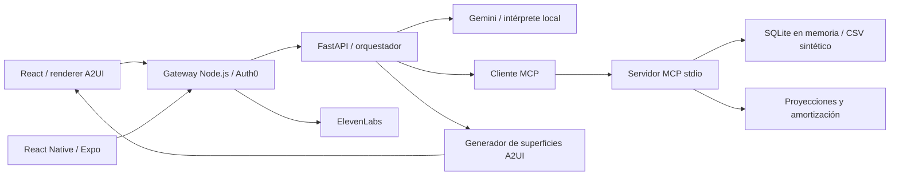

# Arquitectura

La especificación original se conserva en [Arquitectura.md](Arquitectura.md). La aplicación actual conecta Auth0, un dataset sintético amplio, herramientas MCP y superficies A2UI interactivas en la web.

| Capa            | Ruta                                                | Estado                                                                                                                              |
| --------------- | --------------------------------------------------- | ----------------------------------------------------------------------------------------------------------------------------------- |
| Web             | `apps/web`                                          | Resumen, chat, movimientos, presupuestos, créditos, inversiones y suscripciones; diseño adaptable                                   |
| Mobile nativo | `apps/mobile` | Auth0, chat, A2UI completo con componentes React Native, SVG, simuladores y acciones |
| Gateway         | `services/api`                                      | JWT Auth0, proxy de consultas/acciones/dashboard, voz; no ejecuta operaciones bancarias reales                                      |
| Planificador | `services/ai/app/planner.py` | Gemini interpreta consultas y cambios visuales. Modo estricto y errores mediante MCP; modo local para pruebas |
| MCP | `services/ai/app/mcp` | Cliente y servidor stdio; 14 herramientas, incluida report_query_issue para aclaraciones |
| Datos           | `datasets/synthetic`, `services/ai/app/data`        | 11,602 movimientos reproducibles; SQLite en memoria, filtros y agregaciones                                                         |
| A2UI            | `services/ai/app/a2ui.py`, `packages/visual-engine` | Mensajes v0.9, catálogo financiero propio, Zod, Chart.js y controles interactivos                                                   |
| Infraestructura | `infra`                                             | Compose monta dataset de solo lectura; PostgreSQL/Mongo preparados, aún no usados por las consultas                                 |

## Herramientas MCP

`get_account_overview`, `get_cashflow`, `search_transactions`, `get_spending_breakdown`, `get_income_sources`, `get_budget_status`, `get_debts`, `simulate_debt_payoff`, `get_investment_plans`, `project_investment`, `get_subscriptions`, `confirm_debt_payment`, `customize_financial_view`, `report_query_issue`.

El proceso MCP se inicia durante el ciclo de vida de FastAPI. Sus consultas usan importes en centavos, SQL parametrizado y una lista cerrada de campos de agrupación. El cliente registra nombres de herramientas en `tools_used` para inspeccionar el recorrido de cada respuesta.

## Límites del prototipo

Todos los usuarios ven el mismo perfil sintético de Alex. No hay integración bancaria ni transacciones reales. Los saldos de créditos e inversiones son fotografías ficticias de cierre; las proyecciones usan tasas hipotéticas. Ver [dataset y supuestos](../datasets/synthetic/README.md).

La generación de pantallas usa reglas del orquestador a partir de un plan interpretado por Gemini; no es diseño arbitrario producido por el modelo. El transporte actual es HTTP por lotes y el catálogo A2UI es propio. Ver [protocolo y flujo interactivo](a2ui.md).

PostgreSQL, MongoDB, Solana y cifrado de campos del esquema original siguen pendientes. Un sistema con datos personales necesitaría persistencia y autorización por usuario, auditoría y gestión de claves. La sesión habitual requiere Auth0; el modo sin login se habilita explícitamente con `AUTH_MODE=demo` y las pruebas de navegador lo usan en puertos aislados.

## Referencias

- [Gemini con LangChain](https://docs.langchain.com/oss/python/integrations/chat/google_generative_ai)
- [MCP: servidor](https://modelcontextprotocol.io/docs/develop/build-server)
- [A2UI v0.9](https://a2ui.org/specification/v0_9/server_to_client.json)
- [Auth0 y ElevenLabs en este repo](auth-and-voice.md)
